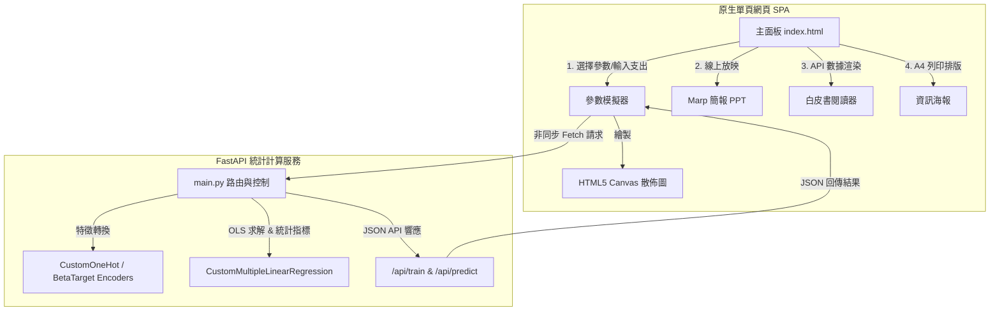

# 50 Startups 獲利預測與貝氏特徵分析實務平台

本專案為第六份職前培訓實務作業，是一個結合統計機器學習與精美前端 SPA 面板的決策支持系統。專案採用 CRISP-DM（跨行業數據挖掘標準流程）框架，系統性整合「自定義 OLS 多元線性迴歸」與「貝氏目標編碼 (Beta Target Encoding)」，量化分析早期新創公司（50 Startups）各項營運支出與地區設立對淨利潤的影響。

作品採用前後端分離架構，後端以 `FastAPI` 驅動，前端以原生 `HTML5`、`Vanilla CSS` 與 `JavaScript` 構建手繪白板風（Excalidraw 質感）互動介面，整合模擬器、A4 實務海報、線上 PPT 簡報、白皮書閱讀器與 TTS 語音影片導覽。

🔗 [**Live Demo**](https://dec591nyc.github.io/50-Startups-Profit-Prediction/frontend/index.html)

---

## 專案 Infography

| 面向 | 內容 |
| --- | --- |
| **專案定位** | 機器學習特徵工程驗證、白盒統計推論與前後端分離部署實務 |
| **資料集** | 50 家具代表性的初創公司數據，包含研發、行政、行銷、設立地區與利潤 |
| **機器學習** | 手寫最小平方法 (OLS) 多元線性迴歸、單熱編碼 (OHE) 與貝氏目標編碼 (BTE) |
| **特徵創新** | 迴歸任務下的 BTE 演算法，提取地區歷史獲利之「後驗期望均值」與「不確定方差」雙特徵 |
| **前端功能** | 參數即時擬合、Canvas 繪圖、Marp 風格線上 PPT、Marked.js 白皮書、TTS 語音導覽 |
| **部署方式** | 前端：GitHub Pages 靜態部署；後端：Render / Hugging Face Spaces 雲端服務 |



---

## 核心功能

1. **互動式迴歸模擬器**：可切換 BTE / OHE 編碼，動態調整「先驗平滑係數 $m$」與「訓練集比例」，隨時點擊 **Refit** 即時重擬模型，並透過雙 HTML5 Canvas 零依賴繪製 R&D 擬合線與預估殘差散佈圖。
2. **營運決策預測面板**：手動輸入或拉動滑桿設定「研發支出」、「行政支出」、「行銷支出」與「設立州別」，估計利潤點預測。
3. **95% 統計信賴區間**：結合 Student's t 分布與殘差標準誤差 (RMSE)，估算預期利潤波動的安全防護帶。
4. **OLS 白盒推論統計表**：列出係數、標準誤差、t 統計量與雙尾 p-Value，並提供互動式的「💡 解讀」按鈕，深入剖析各指標的商業意涵。
5. **A4 單頁實務海報**：專屬 Infographic 設計，完美支持 `@media print` 規格，可直接列印或另存為 A4 規格的統計實務海報。
6. **線上簡報模式 (PPT)**：內建 8 頁 Marp 簡報結構，支援全螢幕、鍵盤/滑鼠切換，並集成 TTS 語音合成引擎，提供 2 分鐘的 upbeat 語音動畫導覽。
7. **技術白皮書閱讀器**：動態拉取後端 Markdown 檔案，利用 Marked.js 即時解析 HTML，並生成具備 Scroll Spy 目錄的高質感學術報告閱讀介面。

---

## 本機執行

### 1. 後端 FastAPI 服務啟動
本機需要安裝 Python 3.8+。

建立虛擬環境並安裝相依套件：
```bash
cd backend
python -m venv venv
# Windows 啟用虛擬環境
.\venv\Scripts\activate
# macOS/Linux 啟用虛擬環境
source venv/bin/activate

pip install -r requirements.txt
```

啟動後端 API 服務：
```bash
python main.py
```
後端服務將會預設運行在：`http://127.0.0.1:8080`。

### 2. 前端網頁開啟
由於項目已經優化為完全自包含的 `frontend` 資料夾結構，您可以：
* 直接在 `frontend/` 資料夾內啟動任何靜態網頁伺服器（例如 VS Code Live Server，或使用 Python）：
  ```bash
  cd frontend
  python -m http.server 5500
  ```
  在瀏覽器中訪問：`http://localhost:5500/index.html`。
* 或是直接在瀏覽器中雙擊開啟 `frontend/index.html`。

---

## 部署步驟指南

本專案採用前後端分離，請按照以下步驟完成雲端部署。

### 步驟 1：後端 FastAPI 部署 (以 Railway / Render 為例)

#### 方案 A：部署至 Railway (推薦)
1. 註冊並登入 [Railway](https://railway.app/)。
2. 點擊 **New Project** -> **Deploy from GitHub repo**，選擇本專案的 Repository。
3. 部署完成後，點擊該服務卡片，進入 **Settings** 頁籤：
   * **Root Directory**: 設定為 `backend` (讓 Railway 定位到後端資料夾)。
   * **Custom Start Command** (選填)：預設 Nixpacks 會偵測並使用 `python main.py`，你也可以手動指定為 `uvicorn main:app --host 0.0.0.0 --port $PORT`。
4. 進入 **Variables** 頁籤，不需特別設定，Railway 會自動注入 `PORT` 環境變數。
5. 進入 **Settings** -> **Networking** -> 點擊 **Generate Domain** 以取得公網 API URL（例如：`https://web-production-xxxx.up.railway.app`）。

#### 方案 B：部署至 Render
1. 註冊並登入 [Render](https://render.com/)。
2. 新增一個 **Web Service**，並連結您的 GitHub 專案。
3. 設定部署屬性：
   * **Environment**: `Python`
   * **Root Directory**: `backend`
   * **Build Command**: `pip install -r requirements.txt`
   * **Start Command**: `uvicorn main:app --host 0.0.0.0 --port 8000` (或使用環境變數的 port)
4. 部署完成後，取得後端雲端 API URL（例如：`https://fifty-startups-profit-prediction-api.onrender.com`）。

### 步驟 2：修改前端後端對接地址
1. 開啟 [frontend/app.js](file:///c:/Users/zifue/Documents/AgenticAI/GooglePlayground/50-Startups-Profit-Prediction/frontend/app.js)。
2. 將第一行的 `BACKEND_URL` 修改為您剛部署好的 Render API URL：
   ```javascript
   // Constants
   const BACKEND_URL = 'https://fifty-startups-profit-prediction-api.onrender.com';
   ```
3. 存檔並提交 git push。

### 步驟 3：前端部署 (以 Vercel / GitHub Pages 為例)

#### 方案 A：部署至 Vercel (推薦，極度簡便且支援單頁應用)
1. 註冊並登入 [Vercel](https://vercel.com/)。
2. 點擊 **Add New** -> **Project**，選擇本專案的 GitHub Repository 並點擊 **Import**。
3. 在 **Configure Project** 頁面中，點擊 **Root Directory** 的 **Edit**，選擇 **`frontend`**。
4. 點擊 **Deploy** 開始部署。
5. 部署完成後，Vercel 會自動為您生成一個公網網址（例如：`https://50-startups-profit-prediction.vercel.app`）。您可直接開啟此網址存取本專案！

#### 方案 B：部署到 GitHub Pages
1. 進入您 GitHub Repository 的 **Settings** -> **Pages**。
2. 在 **Build and deployment** 下，Source 選擇 `Deploy from a branch`。
3. Branch 選擇 `main`，資料夾選擇 `/root`。
4. 點擊儲存，GitHub 將自動構建並發布您的網頁。
5. 您的 Live Demo 地址將會是：`https://<您的帳號>.github.io/50-Startups-Profit-Prediction/frontend/index.html`。

---

## 目錄結構

```text
50-Startups-Profit-Prediction/
├── backend/
│   ├── encoders.py          # 類別型特徵編碼器 (OHE 與 BTE)
│   ├── main.py              # FastAPI 路由與控制器主入口
│   ├── regressor.py         # 自定義 OLS 多元線性迴歸建模與指標計算
│   └── requirements.txt     # Python 相依套件清單
├── data/
│   ├── 50_Startups.csv      # 專案數據集
│   └── download_data.py     # 數據集下載與校驗腳本
├── frontend/
│   ├── index.html           # 前端主 SPA 控制面板
│   ├── style.css            # 精美手繪風白板 CSS 樣式系統
│   ├── app.js               # 前端核心 JS（Canvas 繪圖、PPT、TOC Scroll、TTS 播放與 API 通訊）
│   ├── infographic/
│   │   └── index.html       # 獨立 A4 實務海報頁面
│   ├── nblm/
│   │   ├── nblm_presentation.md
│   │   ├── nblm_presentation.pptx
│   │   └── notebooklm_outline.md
│   └── whitepaper/
│       └── technical_whitepaper.md
├── tests/
│   └── test_modeling.py     # 後端統計性質與單元測試
└── README.md                # 專案說明文件
```

---

## 技術重點

* **FastAPI**：高效暴露預測與訓練 API，支援 CORS 非同步通訊，提供比 Streamlit 更穩健的 Web 通訊基底。
* **最小平方法 (OLS) 解析求解**：拒絕使用黑盒框架，手寫閉式偏微分矩陣運算 $\hat{\boldsymbol{\beta}} = (X^T X)^{-1} X^T \mathbf{y}$，完全表徵白盒機器學習統計推論。
* **類別特徵處理**：實作了 Dummy Variable 基準對照，避開完全共線性的虛擬變數陷阱；並擴展 Beta 目標編碼至連續迴歸，提取均值與變異數。
* **零依賴 Canvas 繪圖**：利用原生 JS 與 HTML5 Canvas，實現了動態尺標映射與白板風格的散佈圖/擬合曲線渲染。
* **多語音導覽系統**：運用瀏覽器內建的 `SpeechSynthesis` Web Speech API，並適配繁體中文女聲，實作非同步簡報同步語音播報。

---

## 開發收穫

本專案作為機器學習實務的深化練習，為我們帶來了幾項關鍵的開發收穫：

* **商業可解釋性的重要性**：在 VC 風險投資決策中，「白盒模型」所提供的統計顯著性（p-Value）比黑盒預測精準度更具備說服力。透過 OLS 統計參數，我們能明確說出「每投資 1 美元研發，能邊際提升 0.81 美元利潤」，從而科學化地進行資源配置。
* **貝氏特徵工程的 PoC 價值**：State 變數僅包含三個類別（$K=3$），在數學上使用 BTE 是顯著的「過度設計與設計冗餘」。但在本專案中將其作為一個工業級的概念驗證（PoC），完整展示了如何在高基數特徵（如上百個測站或商品類別）的情境下，以先驗平滑因子 $m$ 控制噪聲，並壓縮為 2 個實數特徵防止維度災難與過度擬合。
* **風險量化的決策價值**：單純的點估計在商業環境中缺乏防禦性。專案中引入的「95% 信賴預測區間」為 VC 提供了一道防護網，告知決策者利潤的波動下限與上限，是防範極端風險的重要工具。
* **解耦架構的流暢體驗**：相較於 Streamlit 自帶側邊欄在複雜交互下的卡頓與限制，改用 FastAPI（後端）搭配輕量級 Vanilla JS SPA（前端）能極大提升載入與計算速度，且能自訂精美的 CSS 主題，提供流暢無比的使用者體驗。
